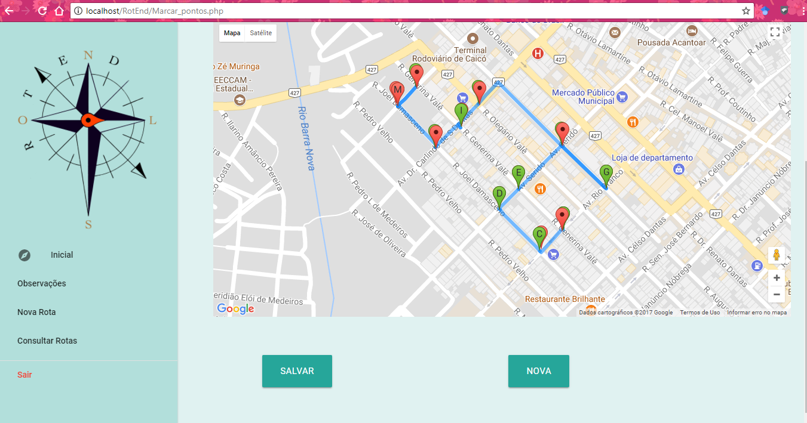

# RotEnd

IMPLEMENTAÇÃO DE SERVIÇO WEB PARA DEFINIÇÃO DE ROTAS DE AGENTES DE ENDEMIAS USANDO GOOGLE MAPS.
Projeto que possui uma programação introdutória, não possuindo uma estruturação adequada, mas bem complexo e útil. Usado como trabalho de conclusão do curso de nível médio integrado de informática no IFRN, esse que obteve nota equivalente a 9.7.

# Curiosos

Se surgiu curiosidade em algum detalhe, e não quer hospedar o sistema para testar, temos o diretório de documentos para supri as dúvidas. 

# Algumas imagens do sistema 
  
  ### Tela Inicial 

   
   
  ### Tela do Login
  
  
  
  ### Tela do Agente Marca os pontos e calcular a menor  rota
  
   
  
  
  
